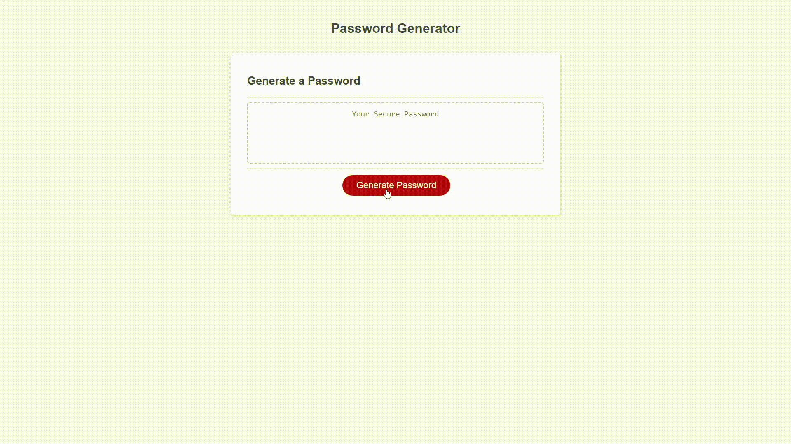

# Password Generator

## Task

For this weeks homework, I was to modify starter code to create a password generator. Using Javascript, I had to prompt a user for information and then display a randomized sequence of characters based on their inputs. 

## Link to Deployed Application

[Here is the link to the deployed application](https://johnkersey2.github.io/password-generator/)

## Screenshot of Application

## Acceptance Criteria 

According to the user story, my application needed to:

Start the password generation process when I hit the "generate password" button

Show a prompt allowing user to input their desired password length (from 8-128 characters)

Have user confirm what types of characters they want in their password 

Validate there was at least one input critera selected before moving on

When all prompts are answer, generate password either in alert or written to page

## Unsolved Issues

## Resolved Issues

Alert added to warn user they did select any character types

## Future Development Notes

Code can probably be shortened dramatically by changing generateCharacter function. Working idea is to create a variable with a string and then have the function check the variables set for each character type. If true, the function can then add the characters to the new variable, and then have that variable returned to the generatePassword function. 

